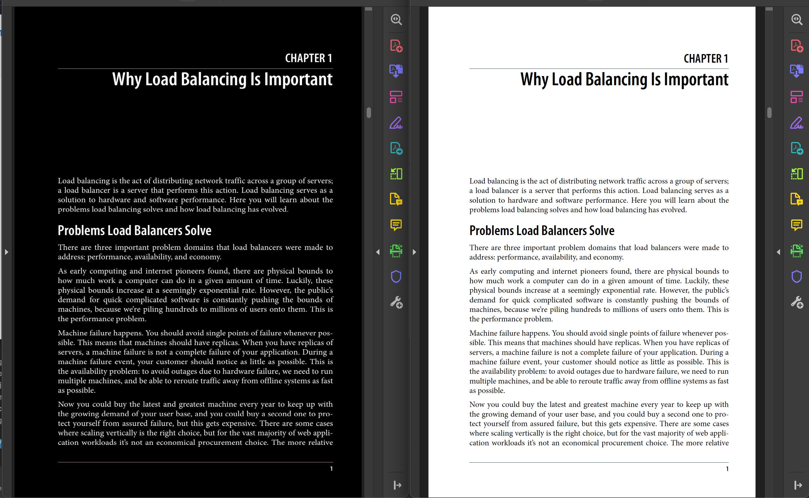

# Invert The Light PDF - Dark PDF
-  [Temporary dark mode on browser](pdfdarkmode.md)
#

The project is forked from [merkez](https://github.com/merkez/darkpdf)

- There was a little bug in code to run in windows. that is fixed.
#
### Output of a Sample

 
#
## Methods on Powershell

 ```code
    pip install --upgrade  pip
    pip install -r requirements.txt
 ```

- Place PDF files to [./ORIPDF](./ORIPDF) folder and run script.
- Converted PDF Files will be in root folder of the project.

```python3
    python converter.py 
```